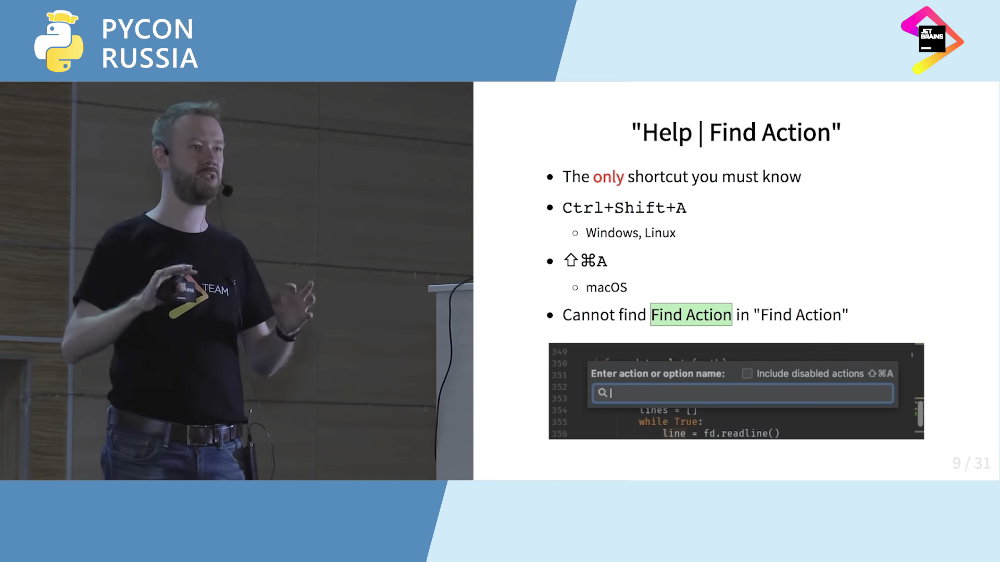
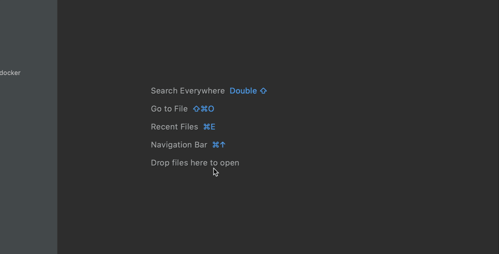

# PyCharm tips and tricks meetup project

[Slides](https://docs.google.com/presentation/d/1KSF7fJds1Q0F6NwgVb-e4qBTvHEIXrMqbGyTjkyaO8U/edit?usp=sharing)

## Introduction

Useful video about PyCharm - [7 советов по редактированию кода в PyCharm](https://www.youtube.com/watch?v=FW3_OPBxk2s)

### Main command

Command for search another PyCharm commands/options/actions:

#### ⌘CMD+⇧Shift+A

## Reed next

* [Code navigation](_1_code_navigation/README.md)
* [Multiselect](_2_multiselect/README.md)
* [Imports](_3_imports/README.md)
* [Live templates](_4_live_templates/README.md)
* [Override](_5_override/README.md)
* [Refactor this](_6_refactor_this/README.md)
* [Tests coverage](_7_tests_coverage/README.md)
* [Run configuration in docker](_8_run_configuration_docker/README.md)
* [Tasks & Time tracking](_9_http_client/README.md)
* [Http client](_10_http_client/README.md)
* [PlantUML](_11_plantuml/README.md)
