# PlantUML plugin

[Cheat sheet of PlantUML](https://ogom.github.io/draw_uml/plantuml/)

## Activity

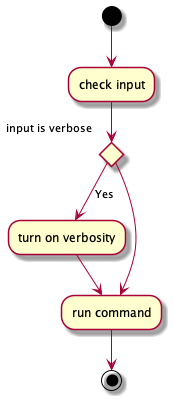

## Class

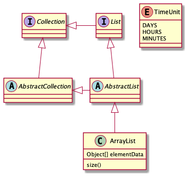

## Component

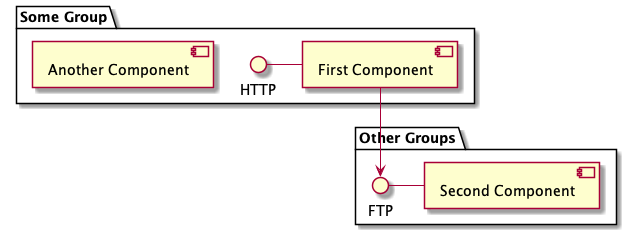

## Gantt

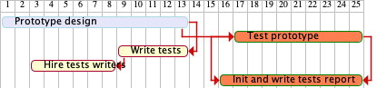

## Mind map

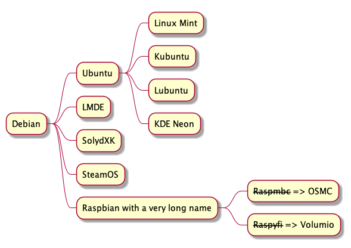

## Object

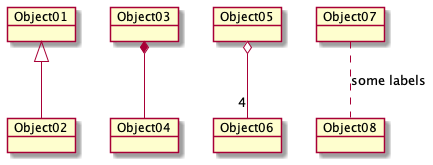

## Sequence

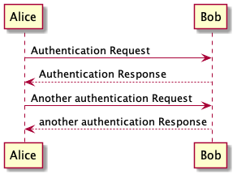

## State

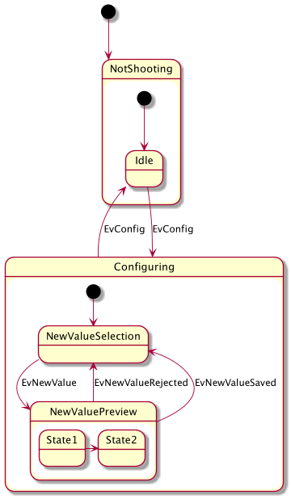

## Use case

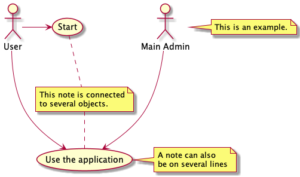

## Interface

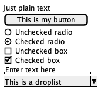

## Structure

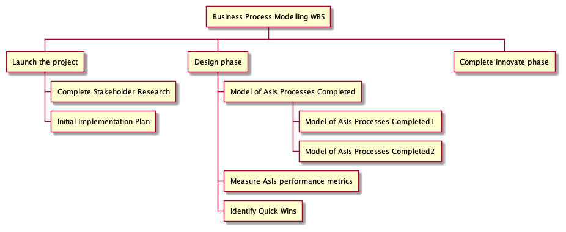
