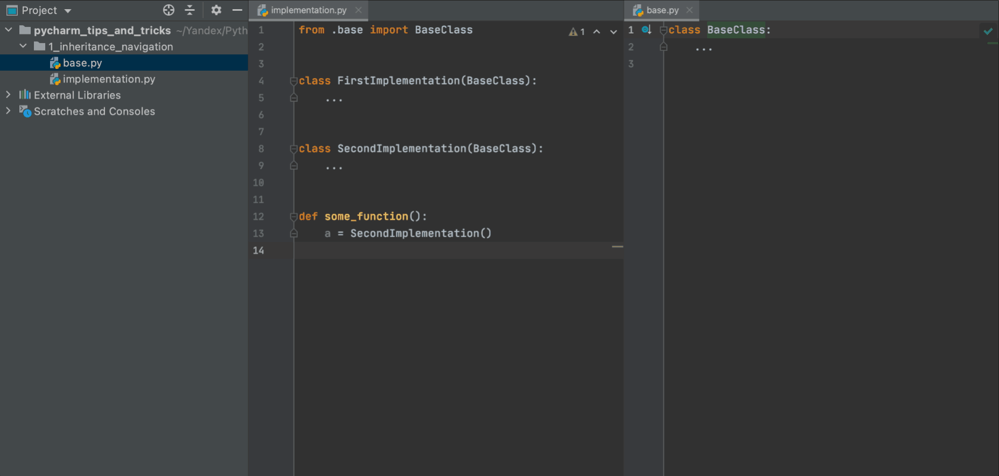
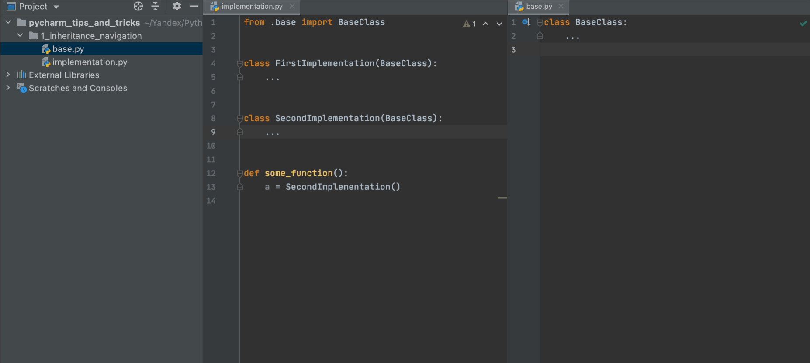
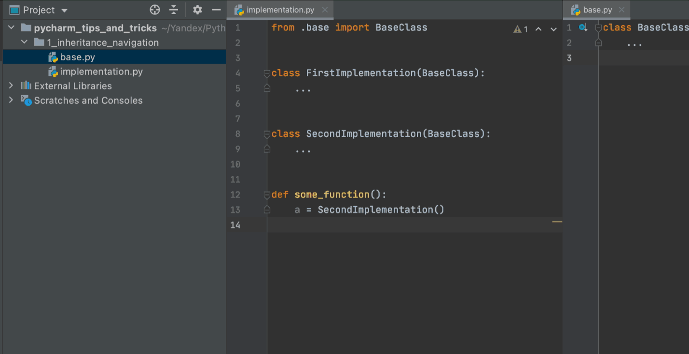
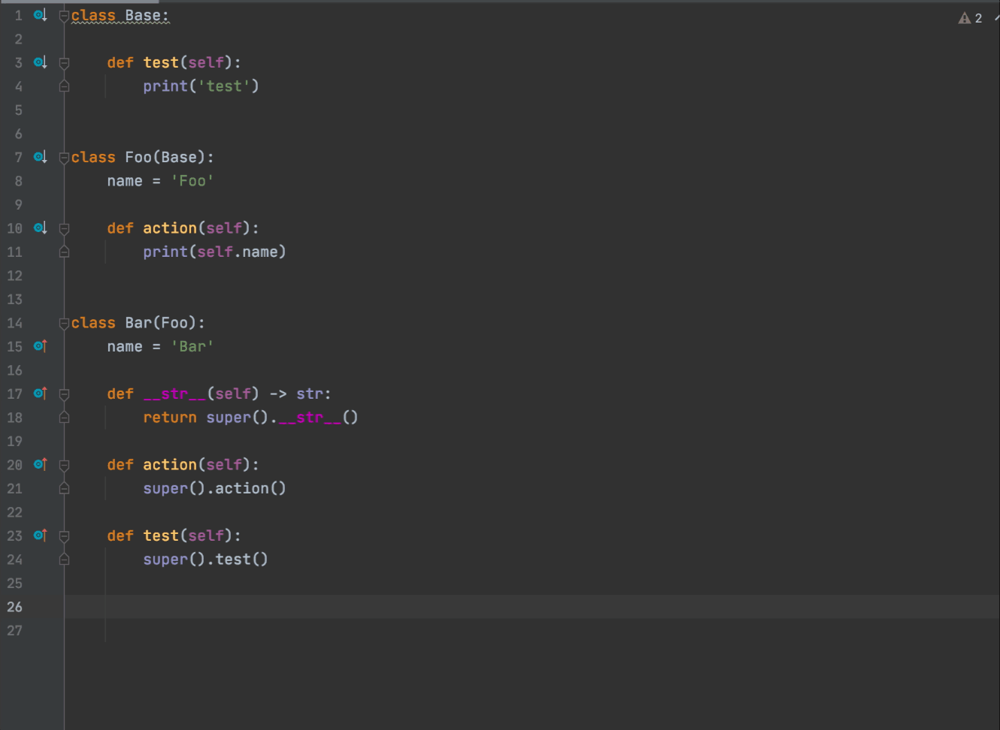
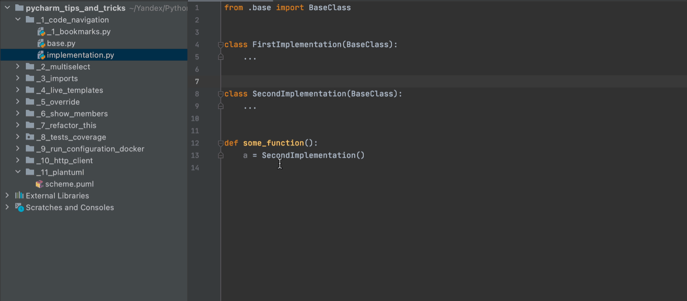
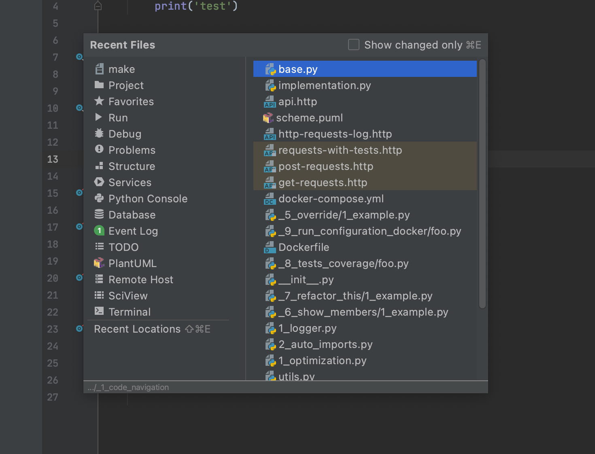

# Code navigation

## Search objects

|Search type|Shortcut            |
|-----------|--------------------|
|All        |**⇧Shift x 2**      |
|Classes    |**⌘CMD+O**          |
|Files      |**⇧Shift+⌘CMD+O**   |
|Symbols    |**⌥Options+⌘CMD+O** |
|Actions    |**⇧Shift+⌘CMD+A**   |

## Text search

**⇧Shift+⌘CMD+F**

## Search in any PyCharm lists

Search by any lists of files/commits/search results

## Bookmarks

|Action     |Shortcut                  |
|-----------|--------------------------|
|Set/remove |**⌃Ctrl+⇧Shift+1,2,3...** |
|Go to      |**⌃Ctrl+1,2,3...**        |

## Forward/backward navigation

|Action     |Shortcut   |
|-----------|-----------|
|Forward    |**⌘CMD+[** |
|Backward   |**⌘CMD+]** |

## Recently usage

**⌘CMD+E**

